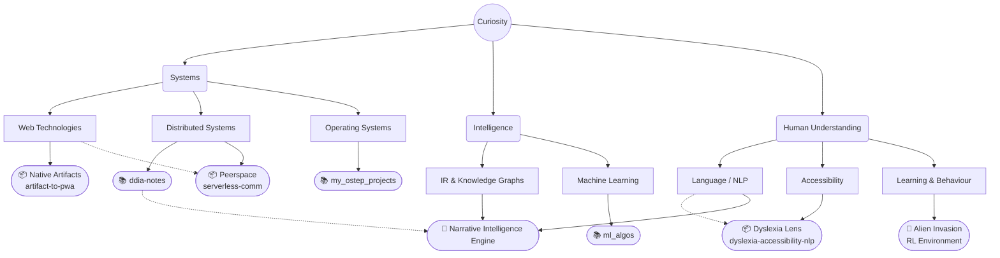

Turning questions into software, one experiment at a time.

[resume (PDF)](Baaqar_Naqi_Resume.pdf) · [email](mailto:baaqarnaqi@gmail.com)

**Currently**
- ✓ Reading — Designing Data-Intensive Applications (Kleppmann)
- ✓ Building — Narrative Intelligence Engine

<i> "What I cannot create, I do not understand." — Richard Feynman </i>

