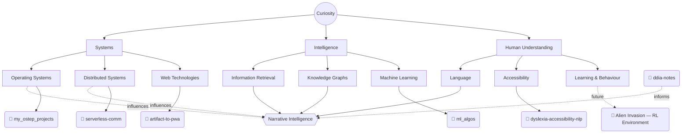

<!-- TODO: replace with your own two or three sentences — non-technical, plain. Placeholder below so the structure is visible, not because this is the right content. -->
Turning questions into software, one experiment at a time.

<!-- TODO: point at an actual resume.pdf committed to this repo, or an external link -->
[resume (PDF)](Baaqar_Naqi_Resume.pdf) · [email](mailto:baaqarnaqi@gmail.com)

**Currently**
- ✓ Reading — Designing Data-Intensive Applications (Kleppmann)
- ✓ Building — Narrative Intelligence Engine

<!-- TODO: replace with your actual quote — someone else's, attributed, or your own -->

<i> "What I cannot create, I do not understand." — Richard Feynman </i>

