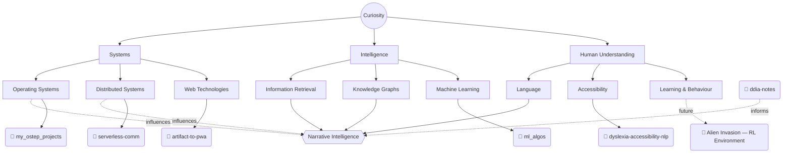

<!-- TODO: replace with your own two or three sentences — non-technical, plain. Placeholder below so the structure is visible, not because this is the right content. -->
I build things to understand them, then usually end up building the next thing because of what the last one didn't explain.

<!-- TODO: point at an actual resume.pdf committed to this repo, or an external link -->
[Resume (PDF)](resume.pdf) · [email](mailto:REPLACE_ME@example.com)

[my_ostep_projects](https://github.com/Baaqar-007/my_ostep_projects) ·
[ml_algos](https://github.com/Baaqar-007/ml_algos) ·
[artifact-to-pwa](https://github.com/Baaqar-007/artifact-to-pwa) ·
[serverless-comm](https://github.com/Baaqar-007/serverless-comm) ·
[dyslexia-accessibility-nlp](https://github.com/Baaqar-007/dyslexia-accessibility-nlp) ·
[ddia-notes](https://github.com/Baaqar-007/ddia-notes)

**Currently**
- ✓ Reading — Designing Data-Intensive Applications (Kleppmann)
- ✓ Building — Narrative Intelligence Engine

<!-- TODO: pick one — a real quote you actually stand behind, or an open question of your own. Draft below is the latter, tied to what NIE is actually stuck on. Delete if neither fits. -->
What does a system need to know about *when* something was true, to actually understand a story instead of just indexing it?
